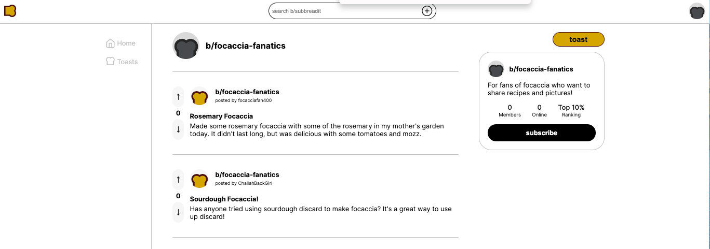
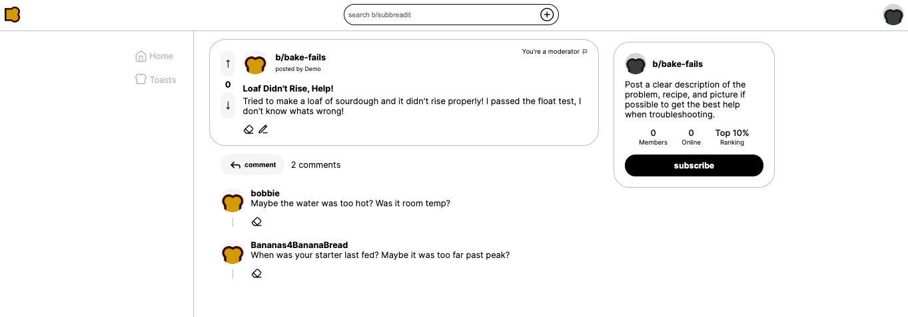

# Breadit

## About our Breadit app:
Breadit is a clone of Reddit, serving the Bread Baking community. It is a platform to share ideas, talk about your own and others' experiences with bread, and browse for new bread ideas.

Live Site: https://breadit-poci.onrender.com

## Technologies Used:

- Flask
- SQLAlchemy
- PostgreSQL
- React
- Redux
- AWS S3
- OAuth2

This project uses Flask as the backend, React and Redux for the frontend rendering and data. Data is stored in a PostgreSQL database, and the backend interfaces with it through SQLAlchemy. Authentication is handled with a CSRF token, so once users sign in, they can remain signed in until that auth expires. Alternative authentication is handled through Google OAuth 2.0 which uses Access Tokens to grant users permissions on the Breadit application without having to create a new account. Images uploaded by users are stored in an AWS S3 bucket, providing users the ability to choose files from their local machine, and ensuring a reliable and consistent source when requesting an image resource.

## Features

### Subbreadits
Individual users can view, search and create Subbreadits. When a user creates a subbreadit they will be assigned moderator and given the ability to delete posts and comments that belong to their subbreadit.

### Subscriptions
Users can curate their experience by subscribing or unsubscribing from subbreadits.

### Toasts
 Users can create a toast on a subbreadit. Users can read all toasts, toasts of a specific subbreadit, a single toast, toasts made by a specific user, and their own toasts. They can edit and delete their own toasts, which will indicate that it has been edited with an 'Edited' tag. They can also delete posts on subbreadits of which they are the moderator.

### Comments
Users can read and create comments on toasts. They can edit and delete their own comments, which will indicate that it has been edited with an 'Edited' tag. They can also delete comments on subbreadits of which they are the moderator.

### Up-Votes/Down-Votes
Users can up-vote or down-vote a toast, allowing them another manner in which to give the original toaster feedback.

### OAuth
Users can sign up and log in with their Google account.

## Build prerequisites

The pg_config program, it is usually installed by the libpq-dev package, if any errors arise:
- sudo apt update
- sudo apt-get install libpq-dev
